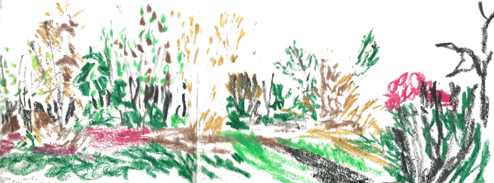

Bonjour, premiere post sur ce blog  de l'association SPORA.
L'association récemment participé à l'appelle à projet de la Fondation Paris Habitat "PRÉSERVATION ET DÉVELOPPEMENT DE LA BIODIVERSITÉ".
On est très content de pouvoir vous dire que notre projet "Habitat SPORA" a été sélectionné dans la première phase du projet.
On est au travail pour pouvoir participer à la deuxième phase.
À bientôt pour des nouvelles.
  

